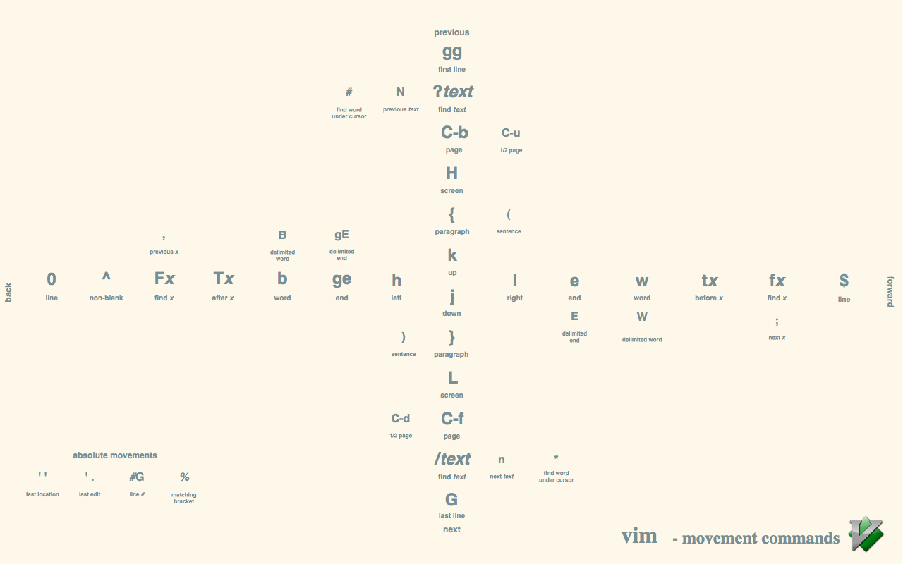
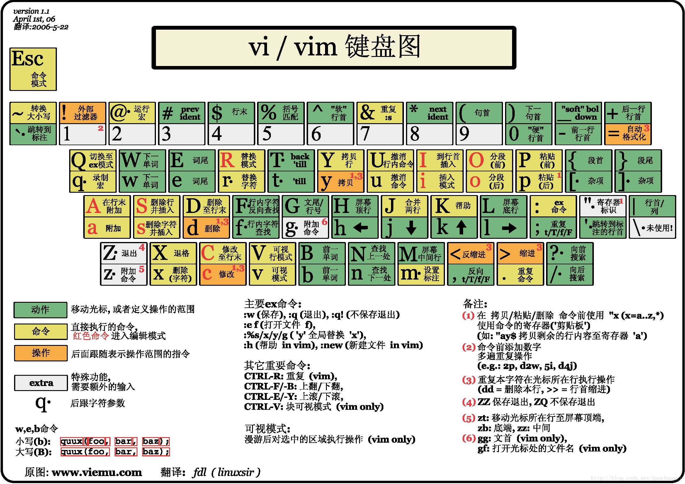

# Vim 備忘單

- [Vim 官網](https://www.vim.org/)
- [Vim GitHub](https://github.com/vim/vim)
- [English](./README.md) | [簡體中文](./README_CN.md) | [繁體中文](./README_TC.md)

## 重複的威力

```
.                   # 小數點，即重複（Dot）命令，重複執行上一次命令
N{command}          # 重複某個命令 N 次，例如：10k，光標上移 10 行
```

發揮重複的威力也要善用宏和正則表達式，減少重複操作。

## 光標移動

> **注意：普通（Normal）模式下，任意一個動作都可以重複。**

```
                    # -------------------- 單位級移動 --------------------
h                   # 光標左移，等效於 <Left> 方向鍵（h 鍵位於左邊，按該鍵光標左移）
j                   # 光標下移，等效於 <Down> 方向鍵（j 鍵有向下的突起，按該鍵光標下移）
k                   # 光標上移，等效於 <Up> 方向鍵 （k 鍵與 j 鍵相反，按該鍵光標上移）
l                   # 光標右移，等效於 <Right> 方向鍵（l 鍵位於右邊，按下該鍵光標向右移動）
                    # -------------------- 單詞級移動 --------------------
w                   # 移動到下一個標點或空格分隔的單詞開頭（w: word）
W                   # 移動到下一個空格分隔的單詞開頭（W: Word）
e                   # 移動到下一個標點或空格分隔的單詞尾部（e: end）
E                   # 移動到下一個空格分隔的單詞尾部（E: End）
b                   # 移動到上一個標點或空格分隔的單詞開頭（b: backward）
B                   # 移動到上一個空格分隔的單詞開頭（B: Backward）
                    # -------------------- 塊級移動 ----------------------
0                   # 跳到行首，數字 0，等效於 <Home> 起始鍵
^                   # 跳到行首非空字符，可以使用 0w 代替 ^，按鍵更方便
$                   # 跳到行尾，等效於 <End> 結尾鍵
ge                  # 向後移動到單詞詞尾
gE                  # 向後移動到空白隔開的單詞詞尾
gg                  # 跳到第一行，等效於 Ctrl+<Home>
G                   # 跳到最後一行，等效於 Ctrl+<End>
[N]G                # 跳到第 N 行，例如 10G 是移動到第 10 行
:N                  # 跳到第 N 行，例如 :10<Enter> 是移動到第 10 行
{count}%            # 移動到文件百分之 {count} 的位置，例如 10% 是移動到文件 10% 的位置
N|                  # 移動到當前行的 N 列
<Enter>             # 移動到下一行首個非空字符
N<Enter>            # 光標向下移動 N 行
)                   # 向前移動一個句子（句號分隔）
(                   # 向後移動一個句子（句號分隔）
}                   # 向前移動一個段落（空行分隔）
{                   # 向後移動一個段落（空行分隔）
+                   # 移動到下一行首個非空字符，等效於 <Enter> 回車鍵
-                   # 移動到上一行首個非空字符
H                   # 移動到屏幕上部（H: High）
M                   # 移動到屏幕中部（M: Middle）
L                   # 移動到屏幕下部（L: Low）
gm                  # 移動到的行中間
gj                  # 光標向下移動一個屏幕行，非實際行，忽略自動換行
gk                  # 光標向上移動一個屏幕行，非實際行，忽略自動換行
<S+Up>              # 按住 <Shift> 上檔鍵再按 <Up> 方向鍵，向上翻頁
<S+Down>            # 按住 <Shift> 上檔鍵再按 <Down> 方向鍵，向下翻頁
<S+Left>            # 按住 <Shift> 上檔鍵再按 <Left> 方向鍵，向左移動一個單詞
<S+Right>           # 按住 <Shift> 上檔鍵再按 <Right> 方向鍵，向右移動一個單詞
:ju[mps]            # 輸出所有跳轉
:cle[arjumps]       # 清除所有跳轉
                    # -------------------- 翻屏移動 ----------------------
zz                  # 調整光標所在行到屏幕中央
zt                  # 調整光標所在行到屏幕上部
zb                  # 調整光標所在行到屏幕下部
Ctrl+e              # 向上滾動一行（e: extra line）
Ctrl+y              # 向下滾動一行
Ctrl+u              # 向上滾動半屏（Move up 1/2 a screen）
Ctrl+d              # 向下滾動半屏（Move down 1/2 a screen）
Ctrl+f              # 向下滾動一屏（Move forward one full screen）
Ctrl+b              # 向上滾動一屏（Move back one full screen）
                    # -------------------- 編程輔助移動 ------------------
%                   # 不僅匹配跳轉到對應的 {} () []，而且能在 if、else、elseif 之間跳躍
gd                  # 跳轉到局部變量定義處，即光標下的單詞的定義
gD                  # 跳轉到全局變量定義處，即光標下的單詞的定義
gf                  # 打開名稱爲光標下文件名的文件
[[                  # 跳轉到上一個頂層函數，例如 C 語言以大括號分隔
]]                  # 跳轉到下一個頂層函數，例如 C 語言以大括號分隔
[m                  # 跳轉到上一個成員函數開頭
]m                  # 跳轉到下一個成員函數開頭
]M                  # 跳轉到下一個成員函數結尾
[M                  # 跳轉到上一個成員函數結尾
[{                  # 跳轉到上一處未匹配的 {
]}                  # 跳轉到下一處未匹配的 }
[(                  # 跳轉到上一處未匹配的 (
])                  # 跳轉到下一處未匹配的 )
[c                  # 跳轉到上一個不同處（diff 時）
]c                  # 跳轉到下一個不同處（diff 時）
]]                  # 跳轉到下一個第一列的 {
][                  # 跳轉到下一個第一列的 }，和上面的對應
[[                  # 跳轉到上一個第一列的 {
[]                  # 跳轉到上一個第一列的 }
[/                  # 跳轉到當前註釋塊開始處
]/                  # 跳轉到當前註釋塊結尾處
]#                  # 跳轉到上一個 if 或者 else 處
[#                  # 跳轉到下一個 else 或者 endif 處
```

注意：塊級 移動要善於使用 Vim 的**書籤**和**標籤頁**功能，實現文件內容及文件之間快速移動。

## 插入模式

```
i                   # 在光標處進入插入模式（i: insert）
I                   # 在行首進入插入模式
a                   # 在光標後進入插入模式（a: append）
A                   # 在行尾進入插入模式
o                   # 在下一行插入新行並進入插入模式
O                   # 在上一行插入新行並進入插入模式
s                   # 刪除光標所在的字符並進入插入模式
S                   # 刪除當前行並插入文本
gi                  # 進入到上一次插入模式的位置
gI                  # 在當前行第 1 列插入
<Esc>               # 退出插入模式
Ctrl+[              # 退出插入模式，等價於 <Esc> 退出鍵
Ctrl+C              # 退出插入模式，等價於 <Esc> 和 Ctrl+[，但不檢查縮寫
```

## 插入模式的命令

> 注意：由 i, I, a, A, o, O, s, S 等命令進入插入模式。

```
<Up>                # 光標向上移動
<Down>              # 光標向下移動
<Left>              # 光標向左移動
<Right>             # 光標向右移動
<S+Up>              # 按住 <Shift> 上檔鍵再按 <Up> 方向鍵，向上翻頁
<S+Down>            # 按住 <Shift> 上檔鍵再按 <Down> 方向鍵，向下翻頁
<S+Left>            # 按住 <Shift> 上檔鍵再按 <Left> 方向鍵，向左移動一個單詞
<S+Right>           # 按住 <Shift> 上檔鍵再按 <Right> 方向鍵，向右移動一個單詞
<PageUp>            # 向上翻頁，<PageUp> 是向上翻頁鍵
<PageDown>          # 向下翻頁，<PageDown> 是向下翻頁鍵
<Delete>            # 刪除光標處字符，<Delete> 是刪除鍵
<Backspace>         # 退格鍵 <Backspace> 向後刪除字符
<Home>              # 光標跳轉行首
<End>               # 光標跳轉行尾
Ctrl+d              # 減少縮進
Ctrl+f              # 減少縮進
Ctrl+t              # 增加縮進
Ctrl+h              # 刪除前一個字符，等價於 <Backspace> 退格鍵
Ctrl+o              # 臨時退出插入模式，執行單條命令又返回插入模式
Ctrl+u              # 當前行刪除到行首所有字符
Ctrl+w              # 刪除光標前的一個單詞
Ctrl+\ Ctrl+O       # 臨時退出插入模式（光標保持），執行單條命令又返回插入模式
Ctrl+R 0            # 插入寄存器（內部 0 號剪貼板）內容，Ctrl+R 後可跟寄存器名
Ctrl+R "            # 插入匿名寄存器內容，相當於插入模式下 p 粘貼
Ctrl+R =            # 插入表達式計算結果，等號後面跟表達式
Ctrl+R :            # 插入上一次命令行命令
Ctrl+R /            # 插入上一次搜索的關鍵字
Ctrl+v {char}       # 插入非數字的字面量
Ctrl+v {code}       # 插入用三位數字表示的 ASCII/Unicode 字符編碼，例如 Ctrl+v 065
Ctrl+v 065          # 插入 10 進制 ASCII 字符（兩數字） 065 即 A 字符
Ctrl+v x41          # 插入 16 進制 ASCII 字符（三數字） x41 即 A 字符
Ctrl+v o101         # 插入 8 進制 ASCII 字符（三數字） o101 即 A 字符
Ctrl+v u1234        # 插入 16 進制 Unicode 字符（四數字）
Ctrl+v U12345678    # 插入 16 進制 Unicode 字符（八數字）
Ctrl+K {ch1} {ch2}  # 插入 digraph（見 :h digraph），快速輸入日文或符號等
```

## 自動補全

```
Ctrl+n              # 插入模式下文字自動補全，最常用的補全
Ctrl+P              # 插入模式下文字自動補全
Ctrl+e              # 有補全列表時，終止這次補全，繼續輸入

Ctrl+X              # 進入補全模式，注意：智能補全命令均以組合鍵 Ctrl+X 作爲起始操作，下同
Ctrl+X Ctrl+L       # 補全整行
Ctrl+X Ctrl+N       # 插入模式下根據當前緩衝區關鍵字補全
Ctrl+X Ctrl+K       # 根據字典補全
Ctrl+X Ctrl+T       # 根據同義詞字典補全
Ctrl+X Ctrl+F       # 插入模式下補全文件名
Ctrl+X Ctrl+I       # 根據頭文件內關鍵字補全
Ctrl+X Ctrl+]       # 標籤文件關鍵詞補全
Ctrl+X Ctrl+D       # 補全宏定義
Ctrl+X Ctrl+V       # 補全 Vim 命令
Ctrl+X Ctrl+U       # 用戶自定義補全方式
Ctrl+X Ctrl+S       # 拼寫建議，例如：一個英文單詞
Ctrl+X Ctrl+O       # 插入模式下全能 Omnifunc 補全
```

## 文本編輯

```
r                   # 替換當前字符（r: replace）
R                   # 進入替換模式，直至按 <Esc> 退出鍵離開
[N]s                # 替換 N 個字符，即刪除光標後 N 個字符並進入插入模式
[N]S                # 替換 N 行，即刪除 N 行並進入插入模式
[N]x                # 剪切、刪除光標右邊 N 個字符，相當於d[N]l
[n]X                # 剪切、刪除光標左邊 N 個字符，相當於d[n]h

cc                  # 改寫當前行，即刪除當前行並進入插入模式，等效於 S
cw                  # 改寫光標開始處的當前單詞
ciw                 # 改寫光標所處的單詞
caw                 # 改寫光標所處的單詞，並且包括前後空格
c0                  # 改寫到行首
c^                  # 改寫到行首非空字符
c$                  # 改寫到行末
C                   # 改寫到行尾，等效於 c$
ci"                 # 改寫雙引號中的內容，i 的含義下同（i: inner）
ci'                 # 改寫單引號中的內容
cib                 # 改寫小括號中的內容
cab                 # 改寫小括號中的內容，包含小括號本身
ci)                 # 改寫小括號中的內容
ci]                 # 改寫中括號中內容
ciB                 # 改寫大括號中內容
caB                 # 改寫大括號中的內容，包含大括號本身
ci}                 # 改寫大括號中內容
cit                 # 改寫 XML 中 tag 的內容
cis                 # 改寫當前句子
c[N]w               # 改寫光標後 N 個單詞
c[N]l               # 改寫光標後 N 個字母
c[N]h               # 改寫光標前 N 個字母
[N]cc               # 修改當前 N 行
ct(                 # 改寫到小括號前

dd                  # 刪除（剪切）當前行，當前行會存到寄存器裏（d: delete = cut）
dd[N]p              # 刪除（剪切）當前行並加入 N-1 個當前行，複製空行時很有用
d0                  # 刪除（剪切）到行首
d^                  # 刪除（剪切）到行首非零字符
d$                  # 刪除（剪切）到行末
D                   # 刪除（剪切）到行末，等效於 d$
dw                  # 刪除（剪切）當前單詞
diw                 # 刪除（剪切）光標所處的單詞（iw: inner word）
daw                 # 刪除（剪切）光標所處的單詞，幷包含前後空格
d2w                 # 刪除（剪切）下 2 個單詞
d[N]w               # 刪除（剪切）N 個單詞，幷包含前後空格
d[N]l               # 刪除（剪切）光標右邊 N 個字符
d[N]h               # 刪除（剪切）光標左邊 N 個字符
[N]dd               # 刪除（剪切）從當前行開始的 N 行
:Nd                 # 刪除（剪切）第 N 行
:N,Md<CR>           # 刪除（剪切） N ~ M 行，其中 <CR> 爲 <Enter> 回車鍵
di"                 # 刪除（剪切）雙引號中的內容
di'                 # 刪除（剪切）單引號中的內容
dib                 # 刪除（剪切）小括號中的內容
di)                 # 刪除（剪切）小括號中的內容
dab                 # 刪除（剪切）小括號內的內容，包含小括號本身
di]                 # 刪除（剪切）中括號中內容
diB                 # 刪除（剪切）大括號中內容
di}                 # 刪除（剪切）大括號中內容
daB                 # 刪除（剪切）大括號內的內容，包含大括號本身
dit                 # 刪除（剪切） XML 中 tag 的內容
dis                 # 刪除（剪切）當前句子
dt(                 # 刪除（剪切）到小括號前
dgg                 # 刪除（剪切）到文件頭部
d1G                 # 刪除（剪切）到文件頭部，同上
dG                  # 刪除（剪切）到文件尾部
d}                  # 刪除（剪切）下一個段落
d{                  # 刪除（剪切）上一個段落
d/f<CR>             # 比較高級的組合命令，它將刪除 當前位置 到下一個字母 f 之間的內容，其中 <CR> 爲 <Enter> 回車鍵

~                   # 轉換大小寫
g~iw                # 替換當前單詞的大小寫
gUiw                # 將單詞轉成大寫
guiw                # 將當前單詞轉成小寫
guu                 # 全行轉爲小寫
gUU                 # 全行轉爲大寫
Ctrl+A              # 增加數字
Ctrl+X              # 減少數字
```

## 文本對象

> **注意**：只適用於可視模式或在操作符後，例如：操作包括 **選擇 v、刪除 d、複製 y、修改 c** 等。

```
aw                  # 操作整個單詞，不包括分隔符（aw: a word）
aW                  # 操作整個單詞，包括分隔符（aW: a Word）
iw                  # 操作整個單詞，不包括分隔符（iw: inner word）
iW                  # 操作整個單詞，包括分隔符（iW: inner Word）
is                  # 操作整個句子，不包括分隔符 (s: sentence）
ib                  # 操作內含塊，從 [( 到 ])（b: block）
iB                  # 操作內含大塊，從 [{ 到 ]} （B: Block）
ab                  # 操作一個塊，從 [( 至 ])（b: block）
aB                  # 操作一個大塊，從 [{ 到 ]}（B: Block）
ap                  # 操作一個段落（p: paragraph）
ip                  # 操作內含段落
i)                  # 操作小括號字符串
a)                  # 操作小括號字符串，包含小括號本身
i]                  # 操作中括號字符串
a]                  # 操作中括號字符串，包含中括號本身
i}                  # 操作大括號字符串
a}                  # 操作大括號字符串，包含大括號本身
i'                  # 操作單引號字符串
a'                  # 操作單引號字符串，包含單引號本身
i"                  # 操作雙引號字符串
a"                  # 操作雙引號字符串，包含雙引號本身
a`                  # 操作一個反引號字符串
i`                  # 操作內含反引號字符串
a>                  # 操作一個 <> 塊
i>                  # 操作內含 <> 塊
at                  # 操作一個標籤塊，例如 從 <aaa> 到 </aaa>（t: tag）
it                  # 操作內含標籤塊，例如 從 <aaa> 到 </aaa>
2i)                 # 操作往外兩層小括號內
2a)                 # 操作往外兩層小括號內，包含小括號本身
[N]f)               # 移動到第 N 個小括號處
[N]t)               # 移動到第 N 個小括號前
```

文本對象的配對括號、標點及配對標點內的內容的編輯修改對編程非常實用，可以簡單總結爲。

```
ci'、ci"、ci(、ci[、ci{、ci<                # 分別修改這些配對標點符號中的文本內容
ca'、ca"、ca(、ca[、ca{、ca<                # 分別修改這些配對標點符號中的文本內容，包括 標點符號 本身
di'、di"、di(、dib、di[、di{、diB、di<       # 分別刪除這些配對標點符號中的文本內容
da'、da"、da(、dab、da[、da{、daB、da<       # 分別刪除這些配對標點符號中的文本內容，包括 標點符號 本身
yi'、yi"、yi(、yi[、yi{、yi<                # 分別複製這些配對標點符號中的文本內容
ya'、ya"、ya(、ya[、ya{、ya<                # 分別複製這些配對標點符號中的文本內容，包括 標點符號 本身
vi'、vi"、vi(、vi[、vi{、vi<                # 分別選中這些配對標點符號中的文本內容
va'、va"、va(、va[、va{、va<                # 分別選中這些配對標點符號中的文本內容，包括 標點符號 本身
```

## 移動文本

移動文本命令格式。

```
:[range]m[ove]{address}
```

參數說明：

- [range]：表示要移動的行範圍。
- {address}：表示移動的目標位置，這兩個參數都可以缺省。

例如：

```
:m+1                # 下移 1 行
:m-2                # 上移 1 行
:8,10m2             # 把當前打開文件的第 8~10 行內容移動到第 2 行下方
```

## 文字排版

```
[N]>>                     # 向右縮進 N 行，單位爲 shiftwidth
[N]<<                     # 向左縮進 N 行，單位爲 shiftwidth
:ce[nter]                 # 本行文字居中
:le[ft]                   # 本行文字靠左
:ri[ght]                  # 本行文字靠右
:[range]ce[nter] [width]  # 在 range 範圍行的文字居中
:[range]le[ft] [indent]   # 在 range 範圍行的行文字靠左
:[range]ri[ght] [width]   # 在 range 範圍行的行文字靠右
gq                        # 對選中的文字重排，即對過長文字進行斷行
gqq                       # 重排當前行
gq[N]q                    # 重排 N 行
gqap                      # 重排當前段落
gq[N]ap                   # 重排 N 個段落
gq[N]j                    # 重排當前行和下面 N 行
gqQ                       # 重排當前段落到文章末尾
J                         # 將多行合併爲一行
gj                        # 將多行合併爲一行，且合併後不留空格
==                        # 自動縮進，當前文件所有行自動縮進對齊使用 gg=G
```

## 複製粘貼

複製命令的格式。

```
:[range]co[py]{address}
```

參數說明：

- [range]：表示要複製的行範圍，其中 copy 可縮寫爲 :co 或 :t。
- {address}：表示複製的目標位置，這兩個參數都可以缺省，用於表示 Vim 光標所在當前行。

例如：

```
:3copy.             # 複製文件的第 3 行到當前行（當前行用 . 表示）
:3,5t.              # 把第 3 行到第 5 行的內容複製到當前行下方
:t5                 # 把當前行復制到第 5 行下方
:t.                 # 複製當前行到當前行下方，等價於普通模式下的 yyp
:t$                 # 把當前行復制到文本結尾
:'<,'>t0            # 把高亮選中的行復制到文件開頭
```

常用複製粘貼命令。

```
p                   # 粘貼到光標後（p: paste）
P                   # 粘貼到光標前
y                   # 複製標記內容
y0                  # 複製當前光標位置到行首的內容
y$                  # 複製當前位置到本行結束的內容
yy                  # 複製當前行（Yank (copy) a line ）
Y                   # 複製當前行，等效於 yy
yiw                 # 複製當前單詞
y[N]w               # 複製 N 個單詞
y[N]s               # 複製 N 個句子
[N]yy               # 複製光標下 N 行內容
ygg                 # 複製光標以上的所有行
y1G                 # 複製光標以上的所有行，同上
yG                  # 複製光標以下的所有行
yypVr{char}         # 複製字符並替換爲等長指定字符，Markdown 編輯時尤爲好用
:[range]y           # 複製範圍，例如 :20,30y 是複製 20 到 30 行，:10y 是複製第 10 行
:[range]d           # 刪除範圍，例如 :20,30d 是刪除（剪切） 20 到 30 行，:10d 是刪除（剪切）第 10 行
"_[command]         # 使用 [command] 刪除內容，並且不進行復制（不會污染寄存器）
"*[command]         # 使用 [command] 複製內容到系統剪貼板（需要 Vim 版本有 clipboard 支持）
```

## 撤銷與恢復

```
[N]u                # 撤銷命令，N 爲任意整數，表示撤銷 N 步操作，下同（u: undo）
[N]U                # 撤銷整行操作，N 爲任意整數
Ctrl+r              # 撤銷上一次 u 命令（r: redo）
Ctrl+R              # 回退前一個命令
:earlier {N}s       # 回退到 N 秒前的文件內容，其中 s 可替換爲 m（分）、h（小時）、d（天）
:later {N}s         # 前進 N 秒，其中 s 可替換爲 m（分）、h（小時）、d（天）
```

## 查找替換

### 查找命令

普通（Normal）模式下的查找命令（注意：Esc 退出鍵可以中止大部分命令）。

```
/pattern            # 從光標處向文件尾搜索 pattern
?pattern            # 從光標處向文件頭搜索 pattern
n                   # 向同一方向執行上一次搜索
N                   # 向相反方向執行上一次搜索
%                   # 匹配括號移動，包括 ()，{}，[]。結合以下兩個命令相當強大。前提：需要把光標先移到括號上
*                   # 向下搜索光標所在的單詞
#                   # 向前搜索光標所在的單詞
<Shift>*            # 搜索光標所在位置的字符串，不用輸入字符串，查詢速度比 /pattern 快
f{char}             # 向後搜索當前行第一個爲 {char} 的字符，Nfv 可以找到第 N 個爲 v 字符，下同（f: find）
F{char}             # 向前搜索當前行第一個爲 {char} 的字符
t{char}             # 向後搜索當前行第一個爲 {char} 的字符前（t: to）
T{char}             # 向前搜索當前行第一個爲 {char} 的字符前
;                   # 重複上次的字符查找命令（f/t 命令）
,                   # 反轉方向查找上次的字符查找命令（f/t 命令）
tx                  # 搜索當前行到指定 字符串 之前
fx                  # 搜索當前行到指定 字符串 之處
<Esc>               # 放棄查找。例如，啓動了 f 命令後發現想用的是 F 命令，<Esc> 退出鍵放棄查找
```

### substitute 命令替換

普通（Normal）模式下的替換命令格式。

```
:[range]s[ubstitute]/{pattern}/{string}/[flags]
```

參數說明：

- {pattern}：就是要被替換掉的字串，可以用 regexp 來表示。
- {string}：將 pattern 由 string 所取代。
- [range]：有以下一些取值。

| [range]取值 | 含義                                                           |
| :---------: | -------------------------------------------------------------- |
|     無      | 默認光標所在行                                                 |
|      .      | 光標所在當前行                                                 |
|      N      | 第 N 行                                                        |
|      $      | 最後一行                                                       |
|     'a      | 標記 a 所在的行（之前要用 ma 做過標記）                        |
|     $-1     | 倒數第二行，可以對某一行加減某個數值獲得確定的某行             |
|    1,10     | 第 1~10 行                                                     |
|     1,$     | 第一行到最後一行                                               |
|     1,.     | 第一行到當前行                                                 |
|     .,$     | 當前行到最後一行                                               |
|    'a,'b    | 標記 a 所在的行 到 標記 b 所在的行（之前要用 ma、mb 做過標記） |
|      %      | 所有行（和 1，$ 等價）                                         |
|    ?str?    | 從當前位置向上搜索，找到第一個 str 的行（str 可以是正則）      |
|    /str/    | 從當前位置向下搜索，找到第一個 str 的行（str 可以是正則）      |

**注意**：上面的所有用於 range 的表示方法都可以通過 +、- 操作來設置相對偏移量。

- [flags]有以下一些取值：

| [flags]取值 | 含義                                          |
| :---------: | --------------------------------------------- |
|      g      | 對指定範圍內的所有匹配項（g: global）進行替換 |
|      c      | 在替換前請求用戶進行確認（c: confirm）        |
|      e      | 忽略執行過程中的錯誤（e: error）              |
|      i      | 不區分大小寫（i: ignore）                     |
|     無      | 只在指定範圍內的第一個匹配項進行替換          |

舉例：

```
g&                        # 重複上一次 substitute 命令
:s/old/new/               # 當前行的第一個 old 替換爲 new
:s/old/new/g              # 當前行的 old 全部替換爲 new
:s/old/\U&/               # 當前行的 old 替換爲大寫的 OLD
:N,Ms/old/new/g           # 將第 N~M 行中所有的 old 全部替換爲 new
:%s/old/new/g             # 當前文件中的 old 全部替換爲 new
:%s/old/new/gc            # 將當前文件中的 old 全部替換爲 new，並且每處詢問你是否替換
:%s/^/xxx/g               # 在每行行首插入 xxx，^ 表示行首，註釋時非常有用
:%s/./# &                 # 在非空行的行首添加註釋，& 代表前邊匹配到非空行字符
:%s/$/xxx/g               # 在每行行尾插入 xxx，$ 表示行尾
:%s/hello/&, world/       # 將會把 hello 替換成 hello, wolrd
:%s/.*/(&)/               # 將會把所有行用 () 包含起來
:%s/\s\+$//e              # 刪除每行末尾的空格
:%s/1\\2\/3/123/g         # 將 "1\2/3" 替換爲 "123"，特殊字符使用反斜槓標註
:%s/\r//g                 # 刪除 DOS 換行符 ^M
:%s///gn                  # 統計某個模式的匹配個數
:%s/^\n$//gc/             # 替換多個空行爲一個空行
:%s/\n/\r\r/              # 每行後加入空行
:%s/^\s*$\n//g            # 刪除所有空白行
:%s/^M$//g                # 刪除文件中顯式的 ^M 符號，即操作系統換行符問題
:%s/_\(\w\)/\u\1/g        # 將下劃線轉爲駝峯式寫法
:%s/^\(\w\)/\L\1/g        # 將首字母大寫的切換成小寫
:h[elp] s[ubstitute]      # 查看 substitute 替換命令的幫助文檔
```

### global 命令替換

> 還有一種比替換更靈活的方式，它允許匹配到某個指定模式後執行指定的 Ex 命令，即 Vim 的 global 命令，其處理重複工作的效率極高。其命令格式爲：

```
:[range]g[lobal][!]/{pattern}/[cmd]
```

參數說明：

- [range]：表示操作範圍，:global 命令的默認作用範圍是整個文件 (用 % 表示)。 操作範圍參考上面的 [range] 取值。
- [!]：表示反轉 :global 命令的行爲，將在沒有匹配到指定模式的行上執行 cmd。
- {pattern}：指定 :global 命令要匹配的目標模式，若將該域留空，Vim 會自動使用當前(最近一次)的查找模式。
- [cmd]：除 :global 命令之外的任何 Ex 命令，Vim 缺省使用 :print 命令，縮寫爲 :p。

例如：

```
:g/pattern                  # 查找並顯示文件中所有包含模式 pattern 的行，並移動到最後一個匹配處
:g/pattern/p                # 查找並顯示文件中所有包含模式 pattern 的行
:g/\<pattern\>/p            # 查找並顯示文件中所有精確匹配單詞 pattern 的行
:g!/pattern/nu              # 查找並顯示文件中所有不包含模式 pattern 的行，並顯示這些行號
:v/pattern/d                # 刪除所有不包含 pattern 的行
:g/.*/m0                    # 將所有的行按相反的順序排列。其中，查找模式 .* 將匹配所有行，m0 命令將每一行移動到 0 行之後
:g/^/t.                     # 重複每一行，其中 :t 或 :copy 爲複製命令
:g/^/+1 d                   # 刪除偶數行
:g/^/d|m.                   # 刪除奇數行
:g/^$/d                     # 刪除所有空白行
:g/^\s*$/d                  # 刪除所有空白行
:v/./d                      # 刪除所有空白行，其中 . 用於匹配除換行符 \n 外的任何單字符
:g/pattern/d_               # 刪除大量匹配行，避免花費不必要的時間拷貝匹配行至默認寄存器，可以指定黑洞寄存器 _
:N,Mg/pattern/p             # 查找並顯示第 N 到 M 行之間所有包含模式 pattern 的行
:%g/^ xyz/normal dd         # 表示對於以一個空格和 xyz 開頭的行，執行 Normal 模式下的 dd 命令
:g/.\n\n\@!/norm o          # 非空行每行後加入空行，且多個空行合併爲一個空行，\n 末尾匹配換行符，\n\@! 表示 \n 緊接着 \n，則匹配失敗
:h[elp] :g[lobal]           # 查看 global 命令的幫助文檔
```

特別說明：

- substitute 與 global 形式很相似，都是要進行查找匹配，但 substitute 執行的是替換，而 global 執行的其它命令。
- global 命令實際上是分成兩步執行：首先掃描 [range] 指定範圍內的所有行，給匹配 {pattern} 的行打上標記；然後依次對打有標記的行執行 [cmd] 命令，如果被標記的行在對之前匹配行的命令操作中被刪除、移動或合併，則其標記自動消失，而不對該行執行 [cmd] 命令。例子可以參考上面的奇數行、偶數行刪除命令！

### 正則替換

> 高級的查找替換要用到正則表達式。詳情可以查看下面的 正則表達式 命令的幫助文檔。

```
:h[elp] pattern    # 查看 正則表達式 的幫助文檔獲取更多信息
```

> **注意：以下非 Vim 的命令，只代表正則表達式**。

```
                   # ---------------- 表示【目標字符集】的元字符 ---------------
[a-z]              # 表示匹配方括號中列舉的任意一個字符，即匹配 a-z 中的任意一個字符
[^a-z]             # 表示匹配除 方括號中字符以外 的任意字符
.                  # 等價於 [^\n]，表示匹配 任意一個除換行符 ( \n ) 外的其他字符
\l                 # 等價於 [a-z]，表示匹配 任意一個小寫字母
\L                 # 等價於 [^a-z]，表示匹配 任意一個除小寫字母外的其他字符
\u                 # 等價於 [A-Z]，表示匹配 任意一個大寫字母
\U                 # 等價於 [^A-Z]，表示匹配 任意一個除大寫字母外的其他字符
\w                 # 等價於 [0-9A-Za-z_]，表示匹配 任意一個單詞字母
\W                 # 等價於 [^0-9A-Za-z_]，表示匹配 任意一個除單詞字母外的其他字符
\d                 # 等價於 [0-9]，表示匹配 任意一個阿拉伯數字
\D                 # 等價於 [^0-9]，表示匹配 任意一個除阿拉伯數字外的其他字符
\x                 # 等價於 [0-9A-Fa-f]，表示匹配 任意一個十六進制數字
\X                 # 等價於 [^0-9A-Fa-f]，表示匹配 任意一個除十六進制數字外的其他字符
                   # ---------------- 表示【次數】的元字符 ---------------------
*                  # 表示匹配 0 個或者任意個目標字符
\+                 # 表示匹配 1 個或者任意個目標字符
\?                 # 表示匹配 0 個或者1個目標字符
\{N,M}             # 表示匹配 N~M 個目標字符，即最少匹配 N 個目標字符，最多匹配 M-1 個目標字符
\{N}               # 表示匹配 N 個目標字符，即目標字符需連續出現 N 次
\{N,}              # 表示匹配 N 任意個目標字符，即最少匹配 N 個目標字符
\{,M}              # 表示匹配 0~M 個目標字符，即最多匹配 M-1 個目標字符，也可以不匹配字符
                   # ---------------- 表示【位置】的元字符 ---------------------
^                  # 表示匹配 輸入字符串的開始位置 (行首)
$                  # 表示匹配 輸入字符串的結束位置 (行尾)
\<                 # 表示匹配 單詞詞首
\>                 # 表示匹配 單詞詞尾
                   # ---------------- 表示【非打印字符】的元字符 ----------------
\n                 # 表示匹配 一個換行符
\r                 # 表示匹配 一個回車符 Enter 鍵
\t                 # 表示匹配 一個製表符 Tab 鍵
\s                 # 表示匹配 任意一個空白字符，包括空格、製表符、換頁符等
\S                 # 表示匹配 任意一個非空白字符
                   # ---------------- 表示【子模式】的元字符 -------------------
()                 # 任何 () 內部的匹配文本被稱爲 子匹配，會被自動保存到臨時的倉庫中以便後續引用，可以用 \1-9 來依次引用子匹配
```

## 可視模式

> Vim 可視模式下允許選中一塊文本區域，並對文本區域進行 **複製 y、剪切 d、刪除 d、替換 r、改變大小寫** 等操作。

```
v                   # 切換到面向字符的可視模式（v: visual）
V                   # 切換到面向行的可視模式
Ctrl+v              # 切換到面向列塊的可視模式
V>                  # 向右增加縮進
V<                  # 向左減少縮進
v0                  # 選中當前位置到行首
v$                  # 選中當前位置到行末
viw                 # 選中當前單詞
vib                 # 選中小括號內的內容
vi)                 # 選中小括號內的內容
vi]                 # 選中中括號內的內容
viB                 # 選中大括號內的內容
vi}                 # 選中大括號內的內容
vis                 # 選中句子中的內容
vab                 # 選中小括號內的內容，包含小括號本身
va)                 # 選中小括號內的內容，包含小括號本身
va]                 # 選中中括號內的內容，包含中括號本身
vaB                 # 選中大括號內的內容，包含大括號本身
va}                 # 選中大括號內的內容，包含大括號本身
v[N]wd              # 刪除（剪切）選中的 N 個單詞
v[N]wc              # 修改高亮選中的 N 個單詞，並進入插入模式
v[N]w~              # 高亮選中的 N 個單詞轉換大小寫
{visual}o           # 跳轉到可視模式選中區域的另一端（o: other end）
{visual}O           # 跳轉到可視模式選中區域的另一端
{visual}u           # 標記區轉換爲小寫
{visual}U           # 標記區轉換爲大寫
gv                  # 重選上次的高亮選區
g Ctrl+G            # 顯示所選擇區域的統計信息
ggVG                # 選擇全文
<Esc>               # 按 <Esc> 退出鍵退出可視模式
```

## 註釋命令

```
Ctrl+v              # 多行註釋 步驟1：進入命令行模式，按 Ctrl+v 進入可視模式，然後按 j 或者 k 字母鍵選中多行，把需要註釋的行標記起來
I                   # 多行註釋 步驟2：按大寫字母 I 字母鍵，再插入註釋符，例如 #、//
<Esc>               # 多行註釋 步驟3：按 <Esc> 退出鍵就會全部註釋了

Ctrl+v              # 取消多行註釋 步驟1：進入命令模式，按 Ctrl+v 進入可視模式，按 l 字母鍵橫向選中列的個數，例如 #、//，需要選中 2 列
j or k              # 取消多行註釋 步驟2：按字母 j 或者 k 鍵移動選中註釋符號
d                   # 取消多行註釋 步驟3：按 d 字母鍵就可全部取消註釋
```

複雜註釋。

```
:N,M s/^/ 註釋符 /g        # 在指定行 N ~ M 的行首添加註釋（注意冒號）
:N,M s/^ 註釋符 //g        # 在指定行 N ~ M 的行首取消註釋（注意冒號）

:3,5 s/^/#/g              # 註釋第 3 ~ 5 行
:3,5 s/^#//g              # 解除 3 ~ 5 行的註釋

:1,$ s/^/#/g              # 註釋整個文檔
:1,$ s/^#//g              # 取消註釋整個文檔

:%s/^/#/g                 # 註釋整個文檔，此法更快
:%s/^#//g                 # 取消註釋整個文檔
```

## 移動指令圖



## 打開文件

```
vim [options]             # 啓動 Vim 並開啓一個空白緩衝區
vim [options] {file} ..   # 啓動並編輯一個或多個文件
vim [options] -           # 從標準輸入讀入文件
vim [options] -t {tag}    # 編輯與標籤 tag 關聯的文件
vim [options] -q [fname]  # 以快速修復模式開始編輯並顯示首個錯誤。options 選項均參考以下

vim .                     # 打開文件管理器，顯示目錄文件，通過選中文件編輯
vim {file}                # 打開或新建文件，置於光標第一行首
vim + {file}              # 打開文件，置光標於最後一行首
vim +[N] {file}           # 打開文件，置光標於第 N 行首
vim -b {file}             # 以二進制模式打開文件，該模式某些特殊字符 如換行符 ^M 都可以顯示出來
vim -v {file}             # Vi 模式，以普通模式啓動 Ex
vim -e {file}             # Ex 模式，以 Ex 模式啓動 vim
vim -r {file}             # 恢復上次異常退出的文件
vim -R {file}             # 以只讀的方式打開文件，但仍然可以使用 :wq! 寫入
vim -M {file}             # 以只讀的方式打開文件，不可以強制保存 :wq! 寫入
vim -x {file}             # 以加密方式打開文件
vim -p {files}            # 打開多個文件，每個文件佔用一個標籤頁
vim -o {files}            # 在水平分割的多個窗口中編輯多個文件
vim -O {files}            # 在垂直分割的多個窗口中編輯多個文件
vim -c cmd {file}         # 在打開文件 file 前，先執行指定命令 cmd
vim +{cmd} {file}         # 在打開文件 file 後，再執行命令 cmd
vim +/string {file}       # 打開文件 file，並將光標停留在第一個匹配的 string 上
vim -d {file1} {file2}    # 同時打開 file1 和 file2 文件並 diff 兩個文件的差異
```

## 保存退出

```
:w                  # 寫入文件並保存，會修改文件的時間戳
:w[rite] {file}     # 按名稱 file 保存文件
:w !sudo tee %      # 以超級用戶權限保存文件，也可以這樣 :w !sudo tee % > /dev/null
:wa                 # 保存所有文件
:wa[ll]             # 保存所有文件
:wqa[ll]            # 保存所有文件並退出
:[N]wn[ext]         # 保存當前文件，並編輯下 N 個文件
:[N]wp[revious]     # 保存當前文件，並編輯上 N 個文件
:q                  # 關閉光標所在的窗口並退出
:q[uit]             # 關閉光標所在的窗口並退出
:q!                 # 不保存文件並強制退出
:qa[ll]             # 放棄所有文件操作並退出
:qa[ll]!            # 放棄所有文件操作並強制退出
:x                  # 保存文件並退出，不會修改文件的時間戳
ZZ                  # 保存已改動的文件，並關閉退出窗口，等效於 :x
ZQ                  # 不保存文件關閉窗口，等效於 :q!
```

## 文件比較

> Vim 的 diff 模式是依賴於 diff 命令的，所以首先保證系統中的 diff 命令是可用的。

```
vimdiff lfile rfile       # 縱向分割窗口比較文件
vim -d lfile  rfile       # 縱向分割窗口比較文件
vim -d -o lfile rfile     # 橫向分割窗口比較文件

:diffs[plit] {file}       # 在當前窗口分割，載入另一個文件 file 進行文件比較
:vert diffs {file}        # 在載入文件時要使用縱向分割
:difft[his]               # 將當前文件加入 diff
:diffp[atch] {patchfile}  # 將 buffer 中的文件載入當前窗口進行文件比較

:diffu[pdate]             # 文件改動後，刷新 diff
:diffu[pdate]!            # 對所有文件更新 diff

:[range]diffpu[t]         # 指定範圍的合併，當前文件的指定範圍內容複製到另一個文件裏
:[range]diffg[et]         # 指定範圍的合併，把另一個文件的指定範圍內容複製到當前行中

]c                        # 在 diff 中的跳轉到下一個不同
[c                        # 在 diff 中的跳轉到上一個不同

:diffo[ff]                # 將目前文件退出 diff 模式
:diffo[ff]!               # 將目前窗口中的所有文件退出 diff 模式
:qa[ll]                   # 不保存文件修改並退出
:wa[ll]                   # 保存全部文件
:wqa[ll]                  # 修改合併後，保存全部文件並退出
```

## 文件操作

```
:e[dit] {file}      # 打開文件並編輯，通過文件的絕對或相對路徑打開文件，Tab 製表鍵補全路徑
:e[dit] .           # 打開文件管理器，瀏覽當前目錄下的文件，選中並編輯
:e[dit]             # 重新載入當前文件
:e[dit]!            # 放棄修改，重新回到文件打開時的狀態
:E[xplore]          # 打開文件管理器，並顯示活動緩衝區所在的目錄
:sav[eas] {file}    # 另存爲指定文件 file
:o {file}           # 在當前窗口打開另一個文件（o: open）
:r {file}           # 讀取文件並將內容插入到光標後
:r !dir             # 將 dir 命令的輸出捕獲並插入到光標後
:on[ly]             # 關閉除光標所在的窗口之外的其他窗口，等效於 Ctrl+W o
:clo[se]            # 關閉光標所在窗口的文件，等效於 Ctrl+W c
:cd {path}          # 切換 Vim 當前路徑至 path
:cd -               # 回到上一次當前目錄
:pwd                # 顯示 Vim 當前路徑
:n[ew] {file}       # 打開一個新的窗口編輯新文件 file
:[N]new             # 打開 N 個新的窗口編輯新文件，N 爲任意正整數
:ene[w]             # 在當前窗口創建新文件
:[N]vne[w]          # 縱向切分 N 個新窗口編輯新文件，N 爲任意正整數
:tabnew             # 在新的標籤頁中編輯新文件
:fin[d] {file}      # 在 path 當中查找文件 {file} 並編輯
:f[ile]             # 顯示當前文件名及光標位置
:f[ile] {name}      # 置當前文件名爲 name
:files              # 查看緩衝區列表
```

## 緩衝區

> 緩衝區（Buffer）是一塊內存區域，用於存儲着正在編輯的文件。在保存緩衝區並退出時，內容也隨之被寫回原始文件。切換緩衝區可以在多個文件中來回編輯，提高編輯效率。

```
:ls                 # 查看緩衝區列表
:files              # 查看緩衝區列表，同上
:buffers            # 查看緩衝區列表，同上
:ls [flags]         # 查看指定狀態的緩衝區，其中 [flags] 參考下面列表取值

:ball               # 爲每個緩衝區打開一個窗口
:bad[d] {name}      # 將名稱爲 name 的文件添加到緩衝區列表
:b[uffer] [N]       # 打開指定緩存編號的緩衝區
:b[uffer] {name}    # 打開名稱爲 name 的緩衝區
:sb[uffer] [N]      # 縱向分割打開指定緩存編號的緩衝區
:sb[uffer] {name}   # 縱向分割打開名稱爲 name 的緩衝區

:bn[ext]            # 切換到下一個緩衝區
:bN[ext]            # 切換到上一個緩衝區
:bp[revious]        # 切換到上一個緩衝區，同上
:bf[irst]           # 切換到第一個緩衝區
:bl[ast]            # 切換到最後一個緩衝區

:bd[elete] [N]      # 刪除指定 N 編號的緩衝區
:N,Mbdelete         # 刪除指定範圍的緩衝區，例如 :3,5bdelete 表示刪除緩存編號在 3~5 範圍的緩衝區
:bun[load][!] [N]   # 卸載緩衝區，! 代表是否強制卸載緩衝區
N Ctrl+^            # 切換緩衝區，先輸入緩存編號，再按 Ctrl+^
```

查看緩衝區列表時，緩衝區狀態包含以下幾種：

| 緩衝區狀態 | 說明                                                              |
| :--------: | ----------------------------------------------------------------- |
|     +      | modified buffers，已更改的緩衝區                                  |
|     -      | buffers with 'modifiable' off，禁用了 modifiable 選項，只讀緩衝區 |
|     =      | readonly buffers，只讀緩衝區                                      |
|     a      | active buffers，活動緩衝區，顯示在當前屏幕上                      |
|     u      | unlisted buffers (overrides the "!")                              |
|     h      | hidden buffers，隱藏緩衝區，已載入但沒顯示在屏幕上                |
|     x      | buffers with a read error，讀入時報錯的緩衝區                     |
|     %      | current buffer，當前緩衝區                                        |
|     #      | alternate buffer，交換緩衝區                                      |
|     R      | terminal buffers with a running job                               |
|     F      | terminal buffers with a finished job                              |
|     ?      | terminal buffers without a job: `:terminal NONE`                  |
|     t      | show time last used and sort buffers                              |

## 分屏窗口

> 分屏窗口是基於 Ctrl+W 快捷鍵的，Ctrl 是控制功能鍵，W 是代表 Windom，Ctrl+W 代表控制窗口的意思。

```
:sp[lit] {file}     # 橫向切分窗口並在新窗口打開文件 file
:[N]sp[lit]         # 橫向切分 N 個當前窗口出來，內容同步，遊標可以不同
:[N]new             # 橫向切分出一個 N 行高的窗口，並編輯一個新文件
:[N]sv[iew] {file}  # 橫向切分窗口並在新窗口打開文件 file，等效於 :split，區別在於當前窗口的內容 只讀
:[N]sf[ind] {file}  # 橫向切分窗口，從 path 中找到文件 file 並編輯之
Ctrl+W s            # 橫向切分當前窗口（s: split）
Ctrl+W f            # 橫向切分出一個窗口，並在新窗口打開名稱爲光標所在詞的文件

:vs[plit] {file}    # 縱向切分窗口並在新窗口打開文件 file（vs: vertical split）
:[N]vsp[lit]        # 縱向切分 N 個當前窗口出來，內容同步，遊標可以不同
:[N]vne[w]          # 縱向切分出一個新窗口
Ctrl+W v            # 縱向切分當前窗口（v:vertical split）

Ctrl+W c            # 關閉當前窗口，但不能關閉最後一個窗口，等效於 :clo[se]
Ctrl+W o            # 關閉其他窗口，只保留當前活動窗口，等效於 :on[ly]
Ctrl+W q            # 退出當前窗口，如果是最後一個窗口，則退出 Vim，等效於 :q[uit]

Ctrl+W h            # 跳轉到左邊的窗口（h 鍵位於左邊，按該鍵光標左移）
Ctrl+W j            # 跳轉到下邊的窗口（j 鍵有向下的突起，按該鍵光標下移）
Ctrl+W k            # 跳轉到上邊的窗口（k 鍵與 j 鍵相反，按該鍵光標上移）
Ctrl+W l            # 跳轉到右邊的窗口（l 鍵位於右邊，按下該鍵光標向右移動）
Ctrl+W H            # 移動當前窗口到最左邊
Ctrl+W J            # 移動當前窗口到最下邊
Ctrl+W K            # 移動當前窗口到最上邊
Ctrl+W L            # 移動當前窗口到最右邊
Ctrl+W              # 切換到下一個窗口（W: Window）
Ctrl+W w            # 循環切換到下一個窗口
Ctrl+W W            # 循環切換到上一個窗口
Ctrl+W p            # 切換至上個訪問過的窗口
Ctrl+W r            # 反轉互換窗口（r: reverse）
Ctrl+W T            # 將當前窗口移到新的標籤頁中
ctrl+W t            # 切換到最上面的窗口
ctrl+W b            # 切換到最下面的窗口
Ctrl+W P            # 跳轉到預覽窗口
Ctrl+W z            # 關閉預覽窗口

Ctrl+W =                     # 設置所有窗口同寬同高
Ctrl+W _                     # 縱向最大化當前窗口
Ctrl+W |                     # 橫向最大化當前窗口
Ctrl+W +                     # 增加當前窗口的行高，前面可以加數字
Ctrl+W -                     # 減少當前窗口的行高，前面可以加數字
Ctrl+W <                     # 減少當前窗口的列寬，前面可以加數字
Ctrl+W >                     # 增加當前窗口的列寬，前面可以加數字
:res[ize] <N>                # 調整當前窗口的高度，增加 N 行
:res[ize] +<N>               # 調整當前窗口的高度，增加 N 行
:res[ize] -<N>               # 調整當前窗口的高度，減小 N 行
:vert[ical] res[ize] <N>     # 調整當前窗口的寬度，增加 N 列
:vert[ical] res[ize] +<N>    # 調整當前窗口的寬度，增加 N 列
:vert[ical] res[ize] -<N>    # 調整當前窗口的寬度，減小 N 列
```

## 標籤頁

```
:tabs               # 顯示所有標籤頁
:tabnew {file}      # 在新標籤頁中編輯新的文件 file
:tabe[dit] {file}   # 在新標籤頁中打開並編輯文件 file
:tabf[ind] {file}   # 在當前目錄搜索 file，並在新標籤頁中打開。請注意，此命令只能打開一個文件
:tab split          # 在新的標籤頁中打開當前窗口裏的文件
:tab ball           # 將緩存中所有文件用標籤頁打開
:tab drop {file}    # 如果文件已被其他標籤頁和窗口打開則跳過去，否則新標籤打開

:tabc[lose]         # 關閉當前標籤頁
:tabo[nly]          # 關閉其他標籤頁

:tabn N             # 切換到第 N 個標籤頁，例如：tabn 3 切換到第 3 個標籤頁
:tabm[ove] N        # 將當前標籤頁移動到第 N 個標籤頁之後，標籤頁編號是從 0 開始計數的
:tabm[ove] +N       # 標籤頁往右移 N 個位置
:tabm[ove] -N       # 標籤頁往左移 N 個位置
:tabr[ewind]        # 切換到第一個標籤頁，等效於 :tabfirst 命令
:tabfir[st]         # 切換到第一個標籤頁
:tabl[ast]          # 切換到最後一個標籤頁
:tabn[ext]          # 切換到下一個標籤頁，等效於 gt
:tabp[revious]      # 切換到上一個標籤頁，等效於 gT
gt                  # 切換到下一個標籤頁
gT                  # 切換到上一個標籤頁
[N]gt               # 切換到第 N 個標籤頁，例如 2gt 將會切換到第 2 個標籤頁
:tabd[o] {cmd}      # 同時在多個標籤頁中執行命令，例如 :tabdo %s/food/drink/g，一次完成對所有文件的替換操作
:tab help           # 在標籤頁打開幫助
:h tabpage          # 查看標籤頁幫助文檔
```

## Vim 書籤

> Vim 書籤可以在文件內容及文件之間快速定位到指定位置。

```
m{mark-name}                 # 創建名稱爲 mark-name 的書籤
:marks                       # 查看並列出所有書籤
:marks {mark-name}           # 查看名稱爲 mark-name 書籤的詳情信息
`{mark-name}                 # 跳轉到書籤的確切位置。請注意，此字符是後退引號
'{mark-name}                 # 跳轉到書籤行的開頭。請注意，此字符是單引號
:delm[arks] {mark-name}      # 刪除書籤，可以批量刪除
:delm[arks]!                 # 刪除所有當前緩衝區的書籤，但不包括 A-Z 和 0-9 的書籤
:h marks                     # 查看書籤幫助文檔
```

例如：

```
:marks              # 查看所有書籤
m{a-zA-Z}           # 創建書籤，小寫的是文件書籤，大寫的是全局書籤，可以用 a-zA-Z 中的任何字母標記
ma                  # 保存當前位置到書籤 a
:marks a            # 顯示名稱爲 a 書籤的詳細信息
'a                  # 跳轉到書籤 a 所在的行
`a                  # 跳轉到書籤 a 所在位置
``                  # 回到上次跳轉的位置
''                  # 回到上次跳轉的位置
`.                  # 回到上次編輯的位置
'.                  # 回到上次編輯的位置
'A                  # 跳轉到全局書籤 A
['                  # 跳轉到上一個書籤
]'                  # 跳轉到下一個書籤
'<                  # 跳轉到上次可視模式選擇區域的開始
'>                  # 跳轉到上次可視模式選擇區域的結束
:delm a b           # 刪除書籤 a 和 b
:delmarks p-z       # 刪除範圍在 p ~ z 的書籤
```

## 文件瀏覽器

> Vim 7.0 之後內置 Netrw 插件，提供文件瀏覽器功能，相比與 NERDTree 第三方插件來說速度更快，體量更輕，設計更簡潔。

```
:[N]E[xplore][!] [dir]    # 當前窗口中打開文件瀏覽器
:[N]Hex[plore][!] [dir]   # 水平分割窗口打開文件瀏覽器
:[N]Lex[plore][!] [dir]   # 左邊窗口打開文件瀏覽器
:[N]Sex[plore][!] [dir]   # 水平分割窗口打開文件瀏覽器
:[N]Vex[plore][!] [dir]   # 垂直分割窗口打開文件瀏覽器
:Tex[plore] [dir]         # 新標籤頁打開文件瀏覽器
:Rex[plore]               # 返回文件瀏覽器
:Nexplore                 # 定位到下一個匹配文件
:Pexplore                 # 定位到上一個匹配文件
:h[elp] netrw             # 查看更多 Netrw 插件的幫助信息
```

## 拼寫檢查

```
:set spell          # 打開拼寫檢查
:set nospell        # 關閉拼寫檢查
]s                  # 下一處錯誤拼寫的單詞
[s                  # 上一處錯誤拼寫的單詞
zg                  # 加入單詞到拼寫詞表中
zug                 # 撤銷上一次加入的單詞
z=                  # 拼寫建議
```

## 代碼摺疊

```
zf{motion}          # 手動定義一個摺疊（f:fold）
:{range}fold        # 將範圍 {range} 包括的行定義爲一個摺疊
z=                  # 給出拼寫建議
zf                  # 創建代碼摺疊
zF                  # 指定行數 N 創建摺疊
za                  # 切換摺疊
zA                  # 遞歸切換摺疊，即遞歸打開一個關閉的摺疊或關閉一個打開的摺疊
zi                  # 切換摺疊，切換 foldenable（i: invert）
zc                  # 關閉光標下的一個摺疊（c: close）
zC                  # 遞歸關閉摺疊（C: Close）
zj                  # 定位到下一個摺疊處
zk                  # 定位到上一個摺疊處
zd                  # 刪除光標下摺疊（d: delete）
zD                  # 遞歸刪除摺疊（D: Delete）
zE                  # 刪除所有摺疊
zm                  # 收起嵌套的折行，減少 foldlevel（m: more）
zM                  # 關閉所有摺疊，置 foldlevel 爲 0，設置 foldenable
zn                  # 不折疊，重置 foldenable 並打開所有代碼（n: none）
zN                  # 正常摺疊，重置 foldenable 並恢復所有摺疊（N: Normal）
zr                  # 打開嵌套的折行，增加 foldlevel（r: reduce）
zR                  # 打開所有摺疊，置 foldlevel 爲最大值
zo                  # 打開光標下的摺疊（o: open）
zO                  # 遞歸打開摺疊（O: Open）
```

## 文檔加解密

```
vim -x {file}       # 文檔加密，輸入加密密碼並再次確認密碼。注意：不修改內容也要保存，否則密碼設定不會生效
:X                  # 文檔加密，命令模式下輸入加密密碼並再次確認密碼。注意：不修改內容也要保存，否則密碼設定不會生效
:set key={password} # 文檔加密，命令模式下輸入加密密碼並再次確認密碼。注意：不修改內容也要保存，否則密碼設定不會生效

:X                  # 文檔解密，命令模式下直接按 <Enter> 回車鍵，表示密碼爲空。注意：不修改內容也要保存，否則解密設定不會生效
:set key=           # 文檔解密，命令模式下設置 key 的密碼爲空。注意：不修改內容也要保存，否則密碼設定不會生效
```

## 宏錄製

> 宏是錄製和播放功能，是一系列 Vim 命令操作的集成，利用宏可以減少很多重複的複雜操作。

```
q{0-9a-zA-Z"}       # 開始錄製名字爲 {0-9a-zA-Z"} 的宏，例如 qa 表示錄製名字爲 a 的宏
q                   # 結束錄製宏
@{0-9a-z".=*+}      # 播放名字爲 {0-9a-z".=*+} 的宏，例如 @a 表示播放名字爲 a 的宏
@@                  # 播放上一個宏
@:                  # 重複上一個 Ex 命令，即冒號命令
```

**宏** 舉例：需要將以下多行文本的行首鍵入一個 Tab 製表鍵進行 **行首縮進**。

```
set nu
set tabstop=4
set shiftwidth=4
set softtabstop=4
set autoindent
set wrap
syntax on
```

### 錄製宏

1. 先將光標移動到第一行。
2. 在 Normal 模式下，按 q 字母鍵加一個字母開始錄製。例如按下 qa，將該宏註冊爲 a。
3. 按下 I 字母鍵在行首插入，在編輯模式按下 Tab 製表鍵。按 <Esc> 退出鍵返回到 Normal 模式。
4. 按下 j 字母鍵將光標移動到下一行。
5. 按下 q 字母鍵完成錄製。

### 使用宏

1. 使用上面錄製的宏 a，按下 @a，播放名字爲 a 的宏。
2. Normal 模式下將光標移動到第二行，按下 @a，再使用了一次宏 a。
3. 多次操作按下 N@a，其中 N 爲正整數，代表執行 N 次宏。例如將光標移動到第 3 行，對餘下的 5 行操作宏 a，按下 5@a。

以上 **錄製宏、使用宏** 兩個共同操作，完成多行文本的行首鍵入一個 Tab 製表鍵進行行首縮進！

## 其它命令

```
ga                  # 顯示光標下字符的 ASCII 碼或者 Unicode 編碼
g8                  # 顯示光標下字符的 UTF-8 編碼字節序
gi                  # 回到上次進入插入的地方，並切換到插入模式
gH                  # 啓動選擇行模式
K                   # 查詢光標下單詞的幫助
Ctrl+G              # 顯示正在編輯的文件名、文件大小和位置信息等信息
g Ctrl+G            # 顯示文件的大小、字符數、單詞數和行數，可視模式下也可用
Ctrl+PgUp           # 上個標籤頁，GVim OK，部分終端軟件需設置對應鍵盤碼
Ctrl+PgDown         # 下個標籤頁，GVim OK，部分終端軟件需設置對應鍵盤碼
Ctrl+R Ctrl+W       # 命令模式下插入光標下單詞
Ctrl+Insert         # 複製到系統剪貼板（GVim）
Shift+Insert        # 粘貼系統剪貼板的內容（GVim）
Ctrl+X Ctrl+E       # 插入模式下向上滾屏
Ctrl+X Ctrl+Y       # 插入模式下向下滾屏
:.!date             # 在當前窗口插入時間
:%!xxd              # 開始二進制編輯
:%!xxd -r           # 保存二進制編輯
:r !curl -sL {URL}  # 讀取 URL 內容添加到光標後
:v/./,/./-j         # 壓縮空行
:Man bash           # 在 Vim 中查看 man，先調用 :runtime! ftplugin/man.vim 激活
/fred\|joe          # 搜索 fred 或者 joe
/\<\d\d\d\d\>       # 精確搜索四個數字
/^\n\{3}            # 搜索連續三個空行
```

## 歷史命令

歷史命令格式。

```
:his[tory] [{name}] [{first}][, [{last}]]
```

參數說明：

- {name}：指定歷史記錄類型。
- {first}：指定命令歷史的起始位置，默認爲第一條記錄。
- {last}：指定命令歷史的終止位置，默認爲最後一條記錄。

在命令行模式下。

```
:his[tory]                # 查看所有命令行模式下輸入的命令歷史
:his[tory] all            # 查看所有類型的歷史記錄
:history c 1,5            # 查看第一到第五條命令行歷史
:history search 或 / 或 ？ # 查看搜索歷史
:call histdel("")         # 刪除歷史記錄
:help :history            # 查看 :history 命令的幫助信息
```

在普通模式下。

```
q/                        # 查看使用 q/ 輸入的搜索歷史
q?                        # 查看使用 q？輸入的搜索歷史
q:                        # 查看命令行歷史
```

## 寄存器

> Vim 寄存器是用於保存臨時數據的地方。Vim 有多個寄存器，可當作多個剪貼板，在使用多個文件時，此功能非常有用，且活用多個寄存器可以顯著提高數據的安全和可操作性。

```
:reg[isters]              # 查看所有寄存器的值
:reg[isters] {args}       # 查看指定 {args} 中提到的寄存器值
"{register}               # 普通模式下調取寄存器值
:Ctrl+r "{reg-name}       # 命令模式下輸入 Ctrl+r 後 Vim 會自動打出 " 寄存器引用符號
Ctrl+r {reg-name}         # 插入模式下無需輸入寄存器引用符號 "
```

例如：

```
"?yy                # 複製當前行到寄存器 ? ，問號代表 0 ~ 9 的寄存器名稱
"?d3j               # 刪除光標下三行內容，並放到寄存器 ? ，問號代表 0 ~ 9 的寄存器名稱
"?p                 # 將寄存器 ? 的內容粘貼到光標後
"?P                 # 將寄存器 ? 的內容粘貼到光標前
```

Vim 寄存器分類。

| 寄存器名稱 &emsp;&emsp;&emsp;&emsp; | 引用方式 &emsp;&emsp;&emsp;&emsp; | 說明                                                                                                                                                                                                           |
| ----------------------------------- | --------------------------------- | -------------------------------------------------------------------------------------------------------------------------------------------------------------------------------------------------------------- |
| 無名寄存器                          | ""                                | 默認寄存器，所有的複製和修改操作（x、s、d、c、y）都會將該數據複製到無名寄存器                                                                                                                                  |
| 字母寄存器                          | "a-zA-Z                           | {register} 只能是一位的 26 個英文字母，從 a-z，A-Z 寄存器內容將會合併到對應小寫字母內容後邊                                                                                                                    |
| 複製專用寄存器                      | "0                                | 僅當使用複製操作(y)時，該數據將會同時被複制到無名寄存器和複製專用寄存器                                                                                                                                        |
| 逐級臨時緩存寄存器                  | "1 - "9                           | 所有不帶範圍（‘(’，‘)’，‘{’，‘}’）、操作涉及 1 行以上的刪除修改操作（x、s、d、c）的數據都會複製到逐級臨時緩存寄存器，並在新的數據加入時，逐級先後推移。1 的數據複製到 2，2 到 3，最後的 9 寄存器內容將會被刪除 |
| 黑洞寄存器                          | "\_                               | 幾乎所有的操作涉及的數據都會被複制到寄存器，如果想讓操作的數據不經過寄存器，可以指定黑洞寄存器，數據到該寄存器就會消失掉，不能顯示，也不存在                                                                   |
| 系統剪切板                          | "+ 或 "\*                         | 與 Vim 外部的 GUI 交互數據時，需要使用專用的系統剪切板                                                                                                                                                         |
| 表達式寄存器                        | "=                                | 所有寄存器裏最特殊的一個，用於計算表達式。輸入完該寄存器應用後，會在命令行裏提示“=”，按需輸入表達式，結果將會顯示到光標處                                                                                      |
| 其他寄存器                          | -                                 | -                                                                                                                                                                                                              |

## 配置文件

> Vim 配置文件有全局和用戶兩種版本，且用戶配置文件優先於全局系統配置文件。

```
:ve[rsion]          # 查看 Vim 版本，同時也查看 Vim 載入配置文件的優先順序及所在位置
:echo $MYVIMRC      # Vim 命令模式下使用該命令輸出 Vim 配置文件的位置
:edit $MYVIMRC      # Vim 命令模式下使用該命令打開 Vim 配置文件
:so[urce] $MYVIMRC  # Vim 配置文件改動後，使用該命令加載新的配置選項，命令縮寫爲 :so %
:echo $VIM          # 輸出全局 vimrc 配置文件位置，存放在 Vim 的安裝目錄中
:echo $HOME         # 輸出用戶 vimrc 配置文件位置，存放在用戶主目錄中
```

在命令行模式下單個設置選項，且選項只在當前窗口生效（命令前記得加上 “:” ，在 **[vimrc 配置文件](./vimrc)** 中則不需要）。

```
:se[t][!]                    # 顯示出所有與其默認值不同的選項，當 [!] 出現時，每個選項都顯示在單獨的行上
:se[t][!] all                # 顯示所有選項列表，當 [!] 出現時，每個選項都顯示在單獨的行上
:se[t] all&                  # 將所有的選項都重置爲默認值
:se[t] {option}&             # 將選項設置爲默認值
:se[t] {option}?             # 查看某個選項的當前值，屏幕底部將顯示其返回值
:se[t] {option}              # 打開某個設置選項， 選項大致可分爲三種：布爾值選項、數值選項和字符串選項
:se[t] no{option}            # 關閉某個設置選項
:se[t] {option}!             # 反轉設置選項
:se[t] inv{option}           # 反轉設置選項，同上
:se[t] {option}:{valus}      # 設置選項的值
:se[t] {option}={valus}      # 設置選項的值，同上
:se[t] {option}+={valus}     # 在選項中增加數值或增加字符串
:se[t] {option}-={valus}     # 在選項中減去數值或移除字符串
:se[t] {option}^={valus}     # 將選項乘以數值或在選項開頭增加字符串
:setl[ocal]                  # 等效於 :set，但對局部選項設定其局部值
:setg[lobal]                 # 等效於 :set，但對局部選項設定其全局值
:h[elp] se[t]                # 查看命令的幫助信息
:map                         # 查看當前 Vim 配置的 map 映射快捷鍵
:inoremap                    # 查看當前 Vim 配置的 inoremap 映射快捷鍵
:nnoremap                    # 查看當前 Vim 配置的 nnoremap 映射快捷鍵
:unm[ap] {lhs}               # 取消 {lhs} 選項的映射，例如 :unmap <F10> 表示取消 F10 的映射
:mapclear                    # 取消所有映射；請注意，該命令將會移除所有用戶定義和系統默認的鍵盤映射，慎用
:mapc[lear]!                 # 清除插入及命令行模式下的映射
:imapc[lear]                 # 清除插入模式下的映射
:vmapc[lear]                 # 清除可視模式下的映射
:omapc[lear]                 # 清除操作符等待模式下的映射
:nmapc[lear]                 # 清除普通模式下的映射
:cmapc[lear]                 # 清除命令行模式下的映射
```

**按鍵映射命令格式：**

```
[prefix]map {lhs} {rhs}      # 將鍵 {lhs} 映射爲 {rhs}，{rhs} 可進行映射掃描，也可遞歸映射
```

參數說明：

- {lhs}：lhs 代表 left-hand-side，即左邊參數。
- {rhs}：rhs 代表 right-hand-side，即右邊參數。
- [prefix]：作用模式前綴，有以下取值。

|   前綴   | 作用模式                                             | 命令格式             | 命令縮寫         |
| :------: | ---------------------------------------------------- | -------------------- | ---------------- |
| \<Space> | 普通、可視、選擇和操作符等待                         | :map {lhs} {rhs}     | 無               |
|    n     | 普通模式                                             | :nmap {lhs} {rhs}    | :nm {lhs} {rhs}  |
|    v     | 可視和選擇模式                                       | :vmap {lhs} {rhs}    | :vm {lhs} {rhs}  |
|    s     | 選擇模式                                             | :smap {lhs} {rhs}    | 無               |
|    x     | 可視模式                                             | :xmap {lhs} {rhs}    | :xm {lhs} {rhs}  |
|    o     | 操作符等待                                           | :omap {lhs} {rhs}    | :om {lhs} {rhs}  |
|    !     | 插入和命令行模式                                     | :map! {lhs} {rhs}    | 無               |
|    i     | 插入模式                                             | :imap {lhs} {rhs}    | :im {lhs} {rhs}  |
|    I     | 插入、命令行和 Lang-Arg 模式                         | :lmap {lhs} {rhs}    | :lm {lhs} {rhs}  |
|    c     | 命令行模式                                           | :cmap {lhs} {rhs}    | :lm {lhs} {rhs}  |
|   nore   | 不遞歸（no rerecursion）映射，和以上前綴自由搭配使用 | :noremap {lhs} {rhs} | :nor {lhs} {rhs} |
|    un    | 取消 :map 綁定的 {lhs}                               | :unmap {lhs}         | 無               |

{rhs} 之前可能顯示的特殊字符：

| 特殊字符 | 意義                         |
| :------: | ---------------------------- |
|    \*    | 不可重映射                   |
|    &     | 僅腳本的局部映射可以被重映射 |
|    @     | 緩衝區的局部映射             |

特殊參數說明（特殊參數必須在映射命令的後邊，{lhs} 參數的前面）：

|    參數    | 說明                                                                                               |
| :--------: | -------------------------------------------------------------------------------------------------- |
| \<buffer>  | 如果映射命令的第一個參數是 <buffer> ，映射將只侷限於當前緩衝區（即此時正在編輯的文件）內           |
| \<silent>  | 執行綁定鍵時不在命令行上回顯按鍵映射的命令內容                                                     |
| \<special> | 一般用於定義特殊鍵怕有副作用的場合                                                                 |
| \<script>  | 該映射只使用通過以 "<SID>" 開頭來定義的腳本局部映射來重映射 {rhs} 中的字符                         |
|  \<expr>   | 如果定義新映射的第一個參數是 <expr> ，那麼參數會作爲表達式來進行計算，計算結果作爲實際使用的 <rhs> |
| \<unique>  | 用於定義新的鍵映射或者縮寫命令時檢查是否該鍵已經被映射，如果該映射或者縮寫已經存在，則該命令會失敗 |

映射快捷鍵時常用的鍵表：

|               鍵               | 鍵說明           | 組合鍵                      |
| :----------------------------: | ---------------- | --------------------------- |
|         \<F1> ~ \<F12>         | 功能鍵 F1 ～ F12 |                             |
|         \<K0> ~ \<K9>          | 數值 0 到 9      |                             |
|            \<Shift>            | Shift 鍵         | <S-...> <s-...> <Shift-...> |
|            \<Ctrl>             | Ctrl 鍵          | <C-...> <c-...> <Ctrl-...>  |
|             \<Alt>             | Alt 鍵           | <A-...> <a-...> <Alt-...>   |
| \<Up>/\<Down>/\<Right>/\<Left> | 方向鍵           |                             |
|             \<Esc>             | Esc 鍵           |                             |
|           \<Leader>            | \ 前綴鍵         |                             |
|             \<Tab>             | Tab 製表鍵       |                             |
|             \<CR>              | Enter 回車鍵     |                             |

在 **[vimrc 配置文件](./vimrc)** 中可以批量設置選項，例如：

```
syntax              # 列出已經定義的語法項
syntax clear        # 清除已定義的語法規則
syntax on           # 允許語法高亮
syntax off          # 禁止語法高亮
set nu              # 設置顯示行號，禁止顯示行號可以用 :set nonu
set number          # 設置顯示行號，禁止顯示行號可以用 :set nonumber
set list            # 設置顯示製表符和換行符
set history=200     # 記錄 200 條歷史命令
set bs=?            # 設置 <Backspace> 退格鍵模式，現代編輯器爲 :set bs=eol,start,indent
set sw=4            # 設置縮進寬度爲 4
set ts=4            # 設置製表符寬度爲 4
set noet            # 設置不展開 Tab 製表鍵成空格
set et              # 設置展開 Tab 製表鍵成空格
set winaltkeys=no   # 設置 GVim 下正常捕獲 <Alt> 換擋鍵
set nowrap          # 關閉自動換行
set ttimeout        # 允許終端按鍵檢測超時（終端下功能鍵爲一串 Esc 開頭的掃描碼）
set ttm=100         # 設置終端按鍵檢測超時爲 100 毫秒
set term=?          # 設置終端類型，例如常見的 xterm
set ignorecase      # 設置搜索是否忽略大小寫
set smartcase       # 智能大小寫，默認忽略大小寫，除非搜索內容裏包含大寫字母
set relativenumber  # 設置顯示相對行號（其他行與當前行的距離）
set paste           # 打開粘貼模式（粘貼時禁用縮進等影響格式的內容）
set nopaste         # 關閉粘貼模式
set spell           # 允許拼寫檢查
set hlsearch        # 開啓高亮查找
set nohlsearch      # 關閉高亮查找
set ruler           # 總是顯示光標位置
set nocompatible    # 設置不兼容原始 vi 模式，該設置必須在最開頭
set incsearch       # 查找輸入時動態增量顯示查找結果
set insertmode      # Vim 始終處於插入模式下，使用 Ctrl+o 臨時執行命令
set ff=unix         # 設置換行爲 unix
set ff=dos          # 設置換行爲 dos
set ff?             # 查看換行設置
set hidden          # 打開隱藏模式，未保存的緩存可以被切換走，或者關閉
set nohidden        # 關閉隱藏模式，未保存的緩存不能被切換走，或者關閉
set termcap         # 查看會從終端接收什麼以及會發送給終端什麼命令
set guicursor=      # 解決 SecureCRT/PenguiNet 中 NeoVim 局部奇怪字符問題
set t_RS= t_SH=     # 解決 SecureCRT/PenguiNet 中 Vim8.0 終端功能奇怪字符
set fo+=a           # 開啓文本段的實時自動格式化
set showtabline=?   # 標籤頁顯示方式，? 爲 0 時隱藏標籤頁，1 會按需顯示，2 會永久顯示
inoremap vv <Esc>   # 插入模式下的 vv 鍵爲 Esc 退出鍵，退出插入模式
nnoremap gh ^       # 普通模式下按 gh 鍵進行行首跳轉，代替數字 0 進行行首跳轉
nnoremap gl $       # 普通模式下按 gl 鍵進行行尾跳轉，代替數字 $ 進行行尾跳轉
```

## 常用插件

**[vim-commentary](https://github.com/tpope/vim-commentary)** 插件是批量註釋工具，可以註釋多行和去除多行註釋。

```
gcc                 # 註釋當前行
gc{motion}          # 註釋 {motion} 所標註的區域，例如 gcap 註釋整段
gci{                # 註釋大括號內的內容
gc                  # 在 Visual Mode 下面按 gc 註釋選中區域
:7,17Commentary     # 註釋 7 到 17 行
```

**[NERDTree](https://github.com/preservim/nerdtree)** 插件用於列出當前路徑的目錄樹。

```
?                   # 快速查看 NERDTree 插件的幫助文檔
o                   # 打開一個目錄或者打開文件，創建的是 Buffer，也可以用來打開書籤
go                  # 打開一個文件，但是光標仍然留在 NERDTree，創建的是 buffer
t                   # 打開一個文件，創建的是 Tab，對書籤同樣生效
T                   # 打開一個文件，但是光標仍然留在 NERDTree，創建的是 Tab，對書籤同樣生效
i                   # 水平分割創建文件的窗口，創建的是 buffer
gi                  # 水平分割創建文件的窗口，但是光標仍然留在 NERDTree
s                   # 垂直分割創建文件的窗口，創建的是 buffer
gs                  # 和 gi，go 類似
x                   # 收起當前打開的目錄
X                   # 收起所有打開的目錄
e                   # 以文件管理的方式打開選中的目錄
D                   # 刪除書籤
P                   # 大寫，跳轉到當前根路徑
p                   # 小寫，跳轉到光標所在的上一級路徑
K                   # 跳轉到第一個子路徑
J                   # 跳轉到最後一個子路徑
C                   # 將根路徑設置爲光標所在的目錄
u                   # 設置上級目錄爲根路徑
U                   # 設置上級目錄爲跟路徑，但是維持原來目錄打開的狀態
r                   # 刷新光標所在的目錄
R                   # 刷新當前根路徑
I                   # 顯示或者不顯示隱藏文件
f                   # 打開和關閉文件過濾器
q                   # 關閉 NERDTree
A                   # 全屏顯示 NERDTree，或者關閉全屏
Ctrl+j Ctrl+k       # 在同級目錄和文件間移動，忽略子目錄和子文件
```

**[asyncrun.vim](https://github.com/skywind3000/asyncrun.vim)** 插件使用 Vim 8、NeoVim 的異步機制，讓你在後臺運行 Shell 命令，並將結果實時顯示到 Vim 的 Quickfix 窗口中。

```
:AsyncRun ls        # 異步運行命令 ls 結果輸出到 Quickfix 窗口使用 :copen 查看
:AsyncRun -raw ls   # 異步運行命令 ls 結果不匹配 errorformat
```

## Vim 模式

```
普通模式             # 按 <Esc> 退出鍵或 Ctrl+[ 進入普通模式，左下角顯示文件名或爲空
插入模式             # 按 i 字母鍵進入插入模式，左下角顯示 --INSERT--
可視模式             # 按 v 字母鍵進入可視模式，左下角顯示 --VISUAL--
選擇模式             # 按 {visual}+Ctrl+g 組合鍵進入選擇模式，左下角顯示 --SELECT--
替換模式             # 按 r 或 R 字母鍵開始替換模式，左下角顯示 --REPLACE--
命令行模式           # 按 : 或者 / 或者 ? 開始命令行模式，左下角無明顯信息
Ex 模式             # 按 Q 字母鍵進入 Ex 模式，與命令行模式類似，執行完命令後，會繼續停留在 Ex 模式，按 :vi[sual] 退出 Ex 模式
```

## 外部命令

```
:!{command}         # 執行一次性 Shell 命令，例如 :!pwd，輸出當前 Vim 模式下所處目錄路徑
:!!                 # 重新執行最近一次運行過的命令
:sh[ell]            # 啓動一個交互的 Shell 執行多個命令，不需要退出Vim。exit 命令退出並返回 Vim
:!ls                # 運行外部命令 ls，並等待返回
:r !ls              # 將外部命令 ls 的輸出捕獲，並插入到光標後
:w !sudo tee %      # sudo 以後保存當前文件，也可以這樣 :w !sudo tee % > /dev/null
:call system('ls')  # 調用 ls 命令，但是不顯示返回內容
:!start notepad     # Windows 下啓動 Notepad，最前面可以加 silent
:sil !start cmd     # Windows 下當前目錄打開 cmd
:%!prog             # 運行文字過濾程序，如整理 JSON 格式 :%!python -m json.tool
```

## GUI 命令

```
:gui                         # UNIX 啓動 GUI
:gui {fname}                 # 同上，並編輯 fname
:menu                        # 列出所有菜單
:menu {mpath}                # 列出 mpath 下的所有菜單
:menu {mpath} {rhs}          # 把 rhs 加入菜單 mpath
:menu {pri} {mpath} {rhs}    # 同上，並帶有優先權 pri
:menu ToolBar.{name} {rhs}   # 把 rhs 加入工具欄
:tmenu {mpath} {text}        # 爲菜單 mpath 加入工具提示
:unmenu {mpath}              # 刪除菜單 mpath
```

## 快速修復窗口

> Quickfix 插件提供的功能，對編譯調試程序非常有用。

```
:cope[n] [height]   # 打開 Quickfix 窗口以顯示當前的錯誤列表，height 表示高度，單位爲行
:lop[en] [height]   # 打開 Quickfix 窗口以顯示當前窗口的位置列表
:ccl[ose]           # 關閉 Qiuckfix 窗口
:lcl[ose]           # 關閉顯示當前窗口位置列表的窗口
:cw[indow] [height] # 出現識別錯誤時打開 Quickfix 窗口；否則什麼也不做
:lw[indow] [height] # 等效於 :cwindow，除了使用顯示當前窗口的位置列表
:cbo[ttom]          # 將光標放在 Quickfix 窗口的最後一行並滾動以使其可見
:lbo[ttom]          # 等效於 :cbottom，除了使用顯示當前位置列表的窗口
:copen 10           # 打開 Quickfix 窗口，並且設置高度爲 10
:cfir[st]           # 跳轉到 Quickfix 窗口中第 1 個錯誤
:cla[st]            # 跳轉到 Quickfix 窗口中最後 1 個錯誤
:cl[ist]            # 在 Quickfix 窗口中列出所有錯誤
:cc [N]             # 顯示第 N 個錯誤的詳細信息
:cn[ext]            # 定位到 Quickfix 窗口中下一個錯誤
:cp[rev]            # 定位到 Quickfix 窗口中上一個錯誤
:cold[er]           # 到前一箇舊列表
:cnew               # 到後一個新列表
```

## 文件編碼

```
:e ++enc=utf8 {file}         # UTF-8 編碼打開 file 文件。
:w ++enc=gbk                 # 不管當前文件什麼編碼，把它轉存成 GBK 編碼。
:set encoding                # Vim 內部編碼查看
:set encoding=UTF-8          # Vim 內部編碼修改
:set fileencoding            # 當前編輯的文件字符編碼查看
:set fileencoding=UTF-8      # 當前編輯的文件字符編碼修改
:set fileencodings           # 查看 Vim 自動探測 fileencoding 的順序列表
:set fileencodings=UTF-8     # 修改 Vim 自動探測 fileencoding 的順序列表
```

文件編碼說明。

- encoding: Vim 內部使用的字符編碼方式，包括 Vim 的緩衝區、菜單文本、消息文本等。
- fileencoding: Vim 中當前編輯的文件的字符編碼方式，Vim 保存文件時也會將文件保存爲這種字符編碼方式。
- fileencodings: Vim 自動探測 fileencoding 的順序列表，啓動時會按照它所列出的字符編碼方式逐一探測即將打開的文件的字符編碼方式，並且將 fileencoding 設置爲最終探測到的字符編碼方式。因此最好將 Unicode 編碼方式放到這個列表的最前面，將拉丁語系編碼方式 latin1 放到最後面。
- termencoding: Vim 所工作的終端字符編碼方式。如果在終端環境下使用 Vim，需要設置 termencoding 和終端所使用的編碼一致。

## 幫助信息

```
:h[elp] {command}   # 顯示相關命令的幫助，也可以就輸入 :help 而不跟命令，退出幫助需要輸入 :q
:h tutor            # 入門文檔
:h quickref         # 快速幫助
:h index            # 查詢 Vim 所有鍵盤命令定義
:h summary          # 幫助你更好的使用內置幫助系統
:h Ctrl+H           # 查詢普通模式下 Ctrl+H 是幹什麼的
:h i_Ctrl+H         # 查詢插入模式下 Ctrl+H 是幹什麼的
:h i_<Up>           # 查詢插入模式下方向鍵上是幹什麼的
:h pattern.txt      # 正則表達式幫助
:h eval             # 腳本編寫幫助
:h function-list    # 查看 VimScript 的函數列表
:h windows.txt      # 窗口使用幫助
:h tabpage.txt      # 標籤頁使用幫助
:h +timers          # 顯示對 +timers 特性的幫助
:h :!               # 查看如何運行外部命令
:h tips             # 查看 Vim 內置的常用技巧文檔
:h set-termcap      # 查看如何設置按鍵掃描碼
:viu[sage]          # 顯示普通命令的幫助。目的是爲了模擬對應的 Nvi 命令
:exu[sage]          # 顯示 Ex 命令的幫助。目的是爲了模擬對應的 Nvi 命令
:ve[rsion]          # 查看 Vim 版本，同時也查看 Vim 載入配置文件的優先順序及所在位置
```

## 有點意思

```
xp                  # 交換兩個字符
ddp                 # 交換兩行
bi                  # 單詞前加入字符
ea                  # 單詞後加入字符
[N]r<Enter>         # 用一個換行符替換 N 個字符
g Ctrl+G            # 單詞統計，按 g 再同時按 Ctrl+g 組合鍵
```

## 約定規範

> 本文檔使用的各種特定字符，按照以下內容進行約定規範。

```
[]                  # 表示方括號裏的字符可選，可達到減少鍵盤輸入及重複操作的目的
[count]             # 可選的數值，可用在命令前以倍數或重複該命令
["x]                # 可選的用於存儲文本的寄存器。參見 registers，x 代表從 'a-zA-z' 的英文字母
{}                  # 花括號裏的內容是命令中必須出現的，但是可以取不同的值
{char1-char2}       # 在 char1 到 char2 區間內的 1 個字符，例如 {a-z} 是一個小寫字母
{motion}            # 表示動作，移動光標的命令或動作
{operator}          # 表示操作符，用於對文本進行刪除或修改操作的命令
{visual}            # 選中的文本區域，先用 v、V 或者 Ctrl+v 設定開始位置，然後用移動光標的命令來選定選擇文本的另一端
Ctrl+{char}         # 作爲控制字符輸入的 {char}；即按住 Ctrl 鍵再按 {char}，{char} 是大寫字母還是小寫字母都一樣
```

## 按鍵說明

> 下面這些按鍵的名稱文檔裏會用到。它們也可以用在 :map 映射命令裏，詳情參見 **[vimrc 配置文件](./vimrc)**。

```
標識符               # 含義

<Nul>               # 數字 0
<BS>                # 退格鍵 <Backspace>
<Tab>               # 製表符 <Tab>
<NL>                # 換行符
<FF>                # 換頁符
<CR>                # 回車符 <Enter>
<Return>            # 同 <CR> 即 <Return>
<Enter>             # 同 <CR> 即 <Enter>
<Esc>               # 轉義
<Space>             # 空格鍵
<lt>                # 小於號 <
<Bslash>            # 反斜槓 \
<Bar>               # 豎槓 |
<Del>               # 刪除鍵
<CSI>               # 命令序列引入
<xCSI>              # 圖形界面的 CSI
<EOL>               # 行尾 (可以是 <CR>、<NL> 或 <CR><NL>，根據不同的系統和 fileformat 而定)

<Up>                # 光標上移鍵
<Down>              # 光標下移鍵
<Left>              # 光標左移鍵
<Right>             # 光標右移鍵
<S-Up>              # Shift ＋ 光標上移鍵
<S-Down>            # Shift ＋ 光標下移鍵
<S-Left>            # Shift ＋ 光標左移鍵
<S-Right>           # Shift ＋ 光標右移鍵
<C-Left>            # Ctrl ＋ 光標左移鍵
<C-Right>           # Ctrl ＋ 光標右移鍵
<F1>-<F12>          # 功能鍵 1 到 12
<S-F1>-<S-F12>      # Shift ＋ 功能鍵 1 到 12
<Help>              # 幫助鍵
<Undo>              # 撤銷鍵
<Insert>            # Insert 鍵
<Home>              # Home
<End>               # End
<PageUp>            # Page-up
<PageDown>          # Page-down

<kHome>             # 小鍵盤 Home (左上)
<kEnd>              # 小鍵盤 End (左下)
<kPageUp>           # 小鍵盤 Page-up (右上)
<kPageDown>         # 小鍵盤 Page-down (右下)
<kPlus>             # 小鍵盤 +
<kMinus>            # 小鍵盤 -
<kMultiply>         # 小鍵盤 *
<kDivide>           # 小鍵盤 /
<kEnter>            # 小鍵盤 Enter
<kPoint>            # 小鍵盤 小數點
<k0>-<k9>           # 小鍵盤 0 到 9

<S-...>             # Shift ＋ 其它鍵
<C-...>             # Ctr ＋ 其它鍵
<M-...>             # Alt ＋ 鍵 或 Meta ＋ 鍵
<A-...>             # 同 <M-...>
```

## Vim 鍵盤圖


